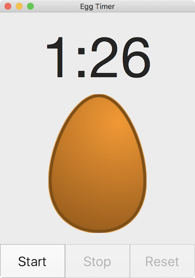

swift 入门教程 --- 教你煮鸡蛋🥚

[macOS Development for Beginners: Part 1](https://www.raywenderlich.com/151741/macos-development-beginners-part-1)

[macOS Development for Beginners: Part 2](https://www.raywenderlich.com/151746/macos-development-beginners-part-2)

[macOS Development for Beginners: Part 3](https://www.raywenderlich.com/151748/macos-development-beginners-part-3)

	

